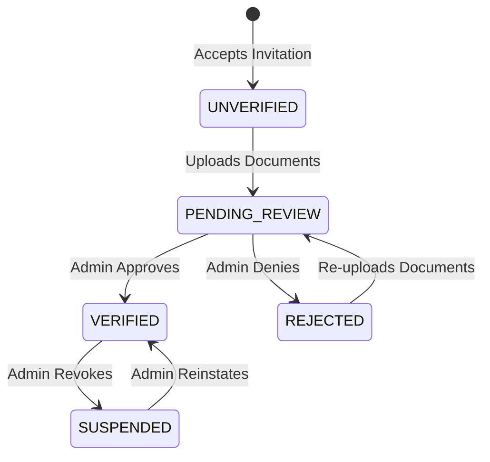

# DOCTOR_STATES.md

> **Last updated**: 2026-03-17
> Reflects the **current implemented system**.
> Actual model: `doctors.DoctorVerification.identity_status` field.

> **Scope**: This document covers **Doctor identity verification states** only.
> For the appointment status machine that doctors control in their UI,
> see `README/WORKFLOWS/APPOINTMENT_BOOKING_WORKFLOW.md` Section 3.

---

## Appointment Status Transitions (Doctor-Controlled)

Doctors can trigger the following status transitions from the `appointment_detail` view.
This is the `_TRANSITION_MAP` implemented in `doctors/views.appointment_detail`:

```
PENDING      → CONFIRMED, CANCELLED
CONFIRMED    → CHECKED_IN, CANCELLED, NO_SHOW
CHECKED_IN   → IN_PROGRESS
IN_PROGRESS  → COMPLETED
COMPLETED    → [terminal]
CANCELLED    → [terminal]
NO_SHOW      → [terminal]
```

When a doctor transitions to CANCELLED, `notify_appointment_cancelled_by_staff` is fired
via `transaction.on_commit()` — the patient receives an in-app + email notification.

Backend enforcement: only whitelisted values from `_TRANSITION_MAP` are accepted from POST.
Stale or tampered POST values are silently ignored.

---

## Purpose

This document defines the lifecycle states (verification states) that a Doctor account can hold within the platform.

The system relies on strong manual administrative verification before doctors are permitted to interact with patients. This state machine ensures doctors transition safely from initial onboarding to public availability.

---

## Core Principle

Becoming a `DOCTOR` in the system is not automatic.

A doctor must pass through administrative review before they become `VERIFIED`.

The core status flag for this lifecycle primarily represents **Platform Administrative Approval**. It determines what the doctor can do and whether patients can see them.

---

## Implementation Note

These states are stored in `DoctorVerification.identity_status` (app: `doctors`).
The `DoctorVerification` record is created automatically when a doctor accepts a clinic invitation.

The actual status values in code use prefixed names:
| Document Name | Actual `identity_status` value |
|---|---|
| UNVERIFIED | `IDENTITY_UNVERIFIED` |
| PENDING_REVIEW | `IDENTITY_PENDING_REVIEW` |
| VERIFIED | `IDENTITY_VERIFIED` |
| REJECTED | `IDENTITY_REJECTED` |
| SUSPENDED | `REVOKED` |

This is a **platform-level** (Layer A) verification. There is also a separate
**per-clinic credential** verification (Layer B) stored in `ClinicDoctorCredential.credential_status`
with values: `CREDENTIALS_PENDING`, `CREDENTIALS_VERIFIED`, `CREDENTIALS_REJECTED`.
See `README/WORKFLOWS/DOCTOR_ONBOARDING/DOCTOR_CREDENTIAL_VERIFICATION.md`.

---

## Doctor State Definitions

### 1. UNVERIFIED (`IDENTITY_UNVERIFIED`)
**Definition:** The doctor has created an account (or accepted an invitation) and holds the `DOCTOR` role, but their identity and medical credentials have not yet been approved by platform administration.

**Capabilities:**
- ✅ Can log into the platform.
- ✅ Can view their account dashboard.
- ✅ Can select and configure their working schedules and availability for the clinics they are linked to.
- ✅ Can upload and submit their verification documents (Identity Document, Medical License).
- ❌ **Cannot** be seen by patients.
- ❌ **Cannot** receive patient bookings.
- ❌ **Cannot** act as the primary treating physician on official platform records.

**Transition In:** Initial state upon accepting a clinic owner's invitation and creating/upgrading the account.
**Transition Out:** Moves to `VERIFIED` if admin approves documents, or `REJECTED` if admin denies them.

---

### 2. PENDING_REVIEW (`IDENTITY_PENDING_REVIEW`)
**Definition:** A sub-state or explicit functional state where the doctor has uploaded their credentials and is waiting for platform administration to review them.

**Capabilities:**
- Same exact restrictions and allowances as `UNVERIFIED`.
- UI should indicate that their documents are currently "Under Review."

**Transition In:** Doctor submits their verification documents.
**Transition Out:** Moves to `VERIFIED` or `REJECTED`.

---

### 3. VERIFIED (`IDENTITY_VERIFIED`)
**Definition:** The doctor's identity and medical practice credentials have been reviewed and explicitly approved by a platform administrator. 

**Capabilities:**
- ✅ Can perform all doctor functions.
- ✅ Appears publicly on the platform (if their clinic is active).
- ✅ Can receive and manage patient appointment bookings.

**Transition In:** Platform admin manually approves the doctor's submitted documents.
**Transition Out:** Can be moved to `SUSPENDED` by admin for policy violations, or reverted to `UNVERIFIED` if their license expires and requires renewal.

---

### 4. REJECTED (`IDENTITY_REJECTED`)
**Definition:** The platform administration reviewed the submitted documents and found them to be invalid, fraudulent, illegible, or insufficient.

**Capabilities:**
- Same restrictions as `UNVERIFIED`.
- Doctor must not be public or bookable.
- UI should explicitly display the rejection reason provided by the admin.
- ✅ Doctor is allowed to re-upload new documents to restart the verification process.

**Transition In:** Platform admin manually rejects the doctor's submitted documents.
**Transition Out:** Moves back to `PENDING_REVIEW` if the doctor submits new documents.

---

### 5. REVOKED (`REVOKED`) — formerly labelled SUSPENDED
**Definition:** The doctor was previously verified but has had their platform access or public visibility revoked by administration (e.g., due to misconduct, expired license, or clinic dispute).

**Capabilities:**
- ❌ Cannot be booked by new patients.
- ❌ Does not appear in search results.
- 🔄 Access to past records or ability to handle already-booked appointments depends on specific suspension severity policies.

**Transition In:** Admin action.
**Transition Out:** Admin action (Reinstatement to `VERIFIED` or permanent account deletion).

---

## State Transition Diagram



---

## Relationship to Invitation States

It is important to distinguish **Doctor Verification States** from **Invitation States**:

- **Invitation States (`PENDING`, `ACCEPTED`, `REJECTED`, `EXPIRED`, `CANCELLED`)** apply only to the *temporary* invitation record sent by a clinic.
- **Doctor Verification States (`UNVERIFIED`, `VERIFIED`, etc.)** apply to the *Doctor's user/profile record itself* and their standing with the platform administration.

A doctor only enters the Verification State Machine (`UNVERIFIED`) *after* the Invitation State becomes `ACCEPTED`.

---

## Postconditions

- The system must enforce that any search query for public doctors or clinic rosters strictly filters by `state = VERIFIED`.
- Admin dashboards must provide a dedicated queue for reviewing doctors in the `PENDING_REVIEW` state.
