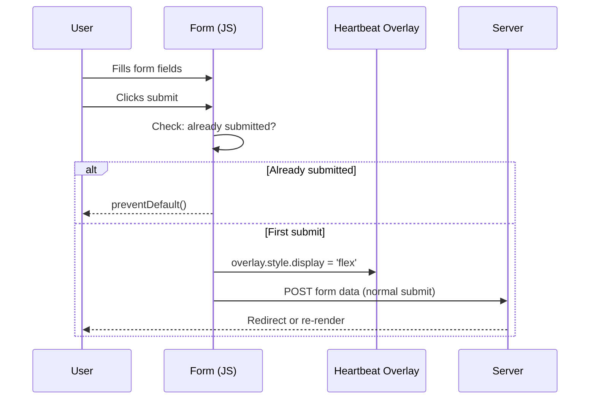

# Loading Indicators — UI/UX, Logic & Flow

> [!IMPORTANT]
> This document defines the standard loading patterns for the platform.
> Two complementary loaders are used: **Heartbeat Medical** (form submissions) and **Skeleton Reveal** (page transitions).

---

## 1. Form Submission — Heartbeat Medical 💓

A frosted overlay with a pulsing heart icon, ECG waveform, and animated dots text.

### Visual Specification

| Property | Value |
| :--- | :--- |
| Background (dark) | `rgba(11, 17, 32, 0.93)` + `blur(8px)` |
| Background (light) | `rgba(255, 255, 255, 0.93)` + `blur(8px)` |
| Position | `absolute`, covers parent card |
| Z-index | `50` |
| Entrance | `hbOverlayFadeIn 0.4s ease` |
| Center icon | Pulsing heartbeat with two expanding rings |
| ECG line | Scrolling SVG waveform |
| Text | Animated trailing dots (`...`) |

### Logic Flow



### Key Behaviors
1. **Hidden by default** (`display: none`).
2. **Activated on submit** — JS sets `display: flex`.
3. **Double-submit prevention** — `submitted` flag blocks extra POSTs.
4. **Non-blocking** — form submits normally; not an AJAX pattern.
5. **Automatic reset** — page re-render clears the overlay.

### Implementation

All form pages use a shared partial and stylesheet:

```html
<!-- 1. In , import the shared CSS -->
<link rel="stylesheet" href="">

<!-- 2. Inside the card/container (as last child), include the partial -->


<!-- 3. In , add the submit handler -->
<script>
(function(){
    var form = document.getElementById('loginForm');
    var overlay = document.getElementById('loginOverlay');
    if (!form || !overlay) return;
    var submitted = false;
    form.addEventListener('submit', function(e) {
        if (submitted) { e.preventDefault(); return; }
        submitted = true;
        overlay.style.display = 'flex';
    });
})();
</script>
```

> [!TIP]
> The parent card must have `position: relative; overflow: hidden;` for the absolute overlay to work. Registration/auth cards already have these styles. Tailwind cards need `relative overflow-hidden` classes.

### Pages & Config

| Page | `overlay_id` | `loader_text` | `loader_icon` |
| :--- | :--- | :--- | :--- |
| Login | `loginOverlay` | جارٍ تسجيل الدخول | `fa-stethoscope` |
| Register Phone | `phoneOverlay` | جارٍ الإرسال | `fa-mobile-screen` |
| Register Verify | `verifyOverlay` | جارٍ التحقق | `fa-shield-halved` |
| Register Details | `detailsOverlay` | جارٍ إنشاء الحساب | `fa-user-plus` |
| Register Email | `emailOverlay` | جارٍ الإرسال | `fa-envelope` |
| Forgot Phone | `fpPhoneOverlay` | جارٍ الإرسال | `fa-mobile-screen` |
| Forgot Verify | `fpVerifyOverlay` | جارٍ التحقق | `fa-shield-halved` |
| Forgot Reset | `resetOverlay` | جارٍ تحديث كلمة المرور | `fa-lock` |
| Change Phone | `changePhoneOverlay` | جارٍ الإرسال | `fa-mobile-screen` |
| Change Phone Verify | `changePhoneVerifyOverlay` | جارٍ التحقق | `fa-shield-halved` |
| Change Email | `changeEmailOverlay` | جارٍ الإرسال | `fa-envelope` |
| Edit Profile | `editProfileOverlay` | جارٍ حفظ التعديلات | `fa-floppy-disk` |

---

## 2. Page Transition — Skeleton Reveal 🦴

A full-page skeleton overlay with a top progress bar, triggered on link navigation.

### Visual Specification

| Component | Details |
| :--- | :--- |
| **Top Bar** | Fixed 3px bar, gradient `#0078D4 → #00BFA5`, animated width 0→95% |
| **Skeleton Overlay** | Full-screen with shimmer shapes simulating content layout |
| **Dark mode** | Dark background (`#0f172a`), white-tint shapes |
| **Light mode** | Light background (`#F8FAFC`), dark-tint shapes |

### Logic
- **Triggered on** any `<a>` click (except `#`, `javascript:`, `target=_blank`, `download`).
- **Hidden on** `pageshow` event (handles back/forward navigation).

### Implementation

Both base templates include the skeleton HTML + JS:

| Base Template | Pages Covered |
| :--- | :--- |
| `accounts/base.html` | Login, registration, forgot-password |
| `patients/base_dashboard.html` | Dashboard, profile, settings |

---

## 3. Files Reference

| File | Role |
| :--- | :--- |
| `static/accounts/css/loader.css` | Shared CSS for both loaders |
| `accounts/templates/accounts/_heartbeat_loader.html` | Reusable partial for form overlays |
| `accounts/templates/accounts/base.html` | Skeleton transition (accounts pages) |
| `patients/templates/patients/base_dashboard.html` | Skeleton transition (dashboard pages) |
